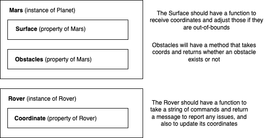

### Install
On Mac:

    brew install llvm

On all platforms (tested on Mac): `make`

### Challenge
- https://github.com/MYOB-Technology/General_Developer/blob/master/katas/kata-mars-rover/kata-mars-rover.md

#### Mars Rover API
- API should maintain a state for the program, and there should optionally be a UI.
- Maybe serve it to localhost and then send it requests via PostMan, for example

#### Things I want to practice
- Functional core, imperative shell
- SOLID principles
- TDD, good covereage
- DDD
- Tell Don't Ask
- Using C++
- CI/CD

#### Domain model

- I was tempted to model this as the planet as a POD, with no methods of its own, and for the rover
  to know about the planet. It seems that using Tell Don't Ask means it makes sense for the planet
  to have certain abilities - like, "tell me if there's an obstacle here".

Diagram made with draw.io

